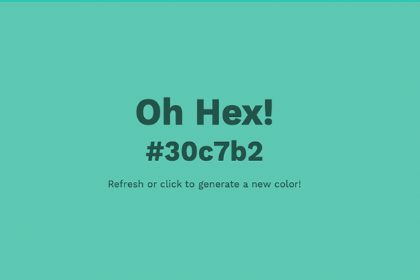

# Oh Hex!

Can't decide which hex color to use? Let the magic of [Oh Hex!](http://shannoncrabill.com/oh-hex/) pick one for you.

Built with Javascript as part of [#7Days7Websites](https://shannoncrabill.com/blog/7-days-7-websites/).

## Installation

Oh Hex! is hosted on the web and can be viewed here

> [shannoncrabill.com/oh-hex](http://www.shannoncrabill.com/oh-hex)

Or, if you want to use it locally, follow these steps

1. Run `git clone https://github.com/scrabill/hex-color-generator.git`
1. `cd hex-color-generator`
1. `open index.html`